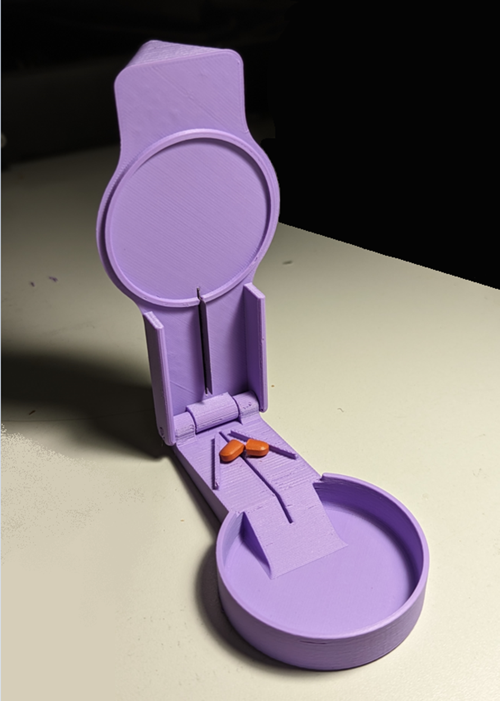

# Pill Splitter
The pill slicer is an easy to use device that slices a pill into two. This device is intended for users that need to cut pills into two and have difficulty doing so without crushing the pill.

## Makers Making Change Assistive Device Library
 - https://www.makersmakingchange.com/s/product/pill-splitter/01tJR00000092fJYAQ

## How to Obtain a Pill Splitter
### 1. Do it Yourself (DIY) or Do it Together (DIT)

This is an open-source assistive technology, so anyone is free to build it. All of the files and instructions required to build the Pill Splitter are contained within this repository. Refer to the Maker Checklist below.

### 2. Request a build of this device

If you would like to obtain a Pill Splitter, you may submit a build request through the [MMC Library Page](https://makersmakingchange.com/project/pill-splitter/). The requestor is responsible for the cost of materials and any shipping.

### 3. How to build this device for someone else

If you have the skills and equipment to build this device, and would like to donate your time to create the switch for someone who needs it, visit the [MMC Maker Wanted](https://makersmakingchange.com/maker-wanted/) section.

## Getting Started

### 1. Read the Makers Checklist

[The Makers Checklist](/Documentation/Pill_Splitter_Maker_Checklist_V1.0.pdf)

### 2. Order the Off-The-Shelf Components

The [Bill of Materials](/Documentation/Pill_Splitter_BOM_V1.0.xlsx) lists all of the parts and components required to build the Pill Splitter. The razor blades are also online or may be available in smaller quantities at your local dollar store.

### 3. Print the 3D Printable components

Print the components

All of the files and individual print files can be in the [/Build_Files/3D_Printing_Files](/Build_Files/3D_Printing_Files/) folder.

### 4. Assemble the Pill Splitter

Reference the [Assembly Guide](/Documentation/Pill_Splitter_Assembly_Guide_V1.0.pdf) for the tools and steps required to build each portion.

## Files
### Documentation
| Document             | Version | Link |
|----------------------|---------|------|
| Design Rationale     | 1.0     | [Pill_Splitter_Design_Rationale](/Documentation/Pill_Splitter_Design_Rationale_V1.0.pdf)     |
| Maker Checklist      | 1.0     | [Pill_Splitter_Maker_Checklist](/Documentation/Pill_Splitter_Maker_Checklist_V1.0.pdf)     |
| Bill of Materials    | 1.0     | [Pill_Splitter_Bill_of_Materials](/Documentation/Pill_Splitter_BOM_V1.0.xlsx)     |
| 3D Printing Guide    | 1.0     | [Pill_Splitter_3D_Printing_Guide](/Documentation/Pill_Splitter_3D_Printing_Guide_V1.0.pdf)     |
| Assembly Guide       | 1.0     | [Pill_Splitter_Assembly_Guide](/Documentation/Pill_Splitter_Assembly_Guide_V1.0.pdf)     |
| User Guide           | 1.0     | [Pill_Splitter_User_Guide](/Documentation/Pill_Splitter_User_Guide_V1.0.pdf)    |
| Changelog            | 1.0     | [Pill_Splitter_Changelog](/Documentation/Pill_Splitter_Changelog_V1.0.pdf)     |

### Design Files
 - [CAD Files](/Design_Files)

### Build Files
 - [3D Printing Files](/Build_Files/3D_Printing_Files)

## Attribution

Designers:
 - Initial design by [Aliaksei Petsiuk @apetsiuk - MyMiniFactory](https://www.myminifactory.com/users/apetsiuk)
 - Modifications and documentation by Neil Squire Society/Makers Making Change

## License
Everything needed or used to design, make, test, or prepare the Pill Splitter is licensed under the [Attribution-NonCommercial-ShareAlike 4.0 ](https://creativecommons.org/licenses/by-nc-sa/4.0/).

Accompanying material such as instruction manuals, videos, and other copyrightable works that are useful but not necessary to design, make, test, or prepare the Pill Splitter are published under a Creative Commons Attribution-ShareAlike 4.0 license https://creativecommons.org/licenses/by-sa/4.0/ (CC BY-SA 4.0).

---

<!-- ABOUT MMC START -->
## About Makers Making Change

Makers Making Change is a program of [Neil Squire](https://www.neilsquire.ca/), a Canadian non-profit that uses technology, knowledge, and passion to empower people with disabilities.

Makers Making Change leverages the capacity of community based Makers, Disability Professionals and Volunteers to develop and deliver affordable Open Source Assistive Technologies.

 - Website: [www.MakersMakingChange.com](https://www.makersmakingchange.com/)
 - GitHub: [makersmakingchange](https://github.com/makersmakingchange)
 - Bluesky: [@makersmakingchange.bsky.social](https://bsky.app/profile/makersmakingchange.bsky.social)
 - Instagram: [@makersmakingchange](https://www.instagram.com/makersmakingchange)
 - Facebook: [makersmakechange](https://www.facebook.com/makersmakechange)
 - LinkedIn: [Neil Squire Society](https://www.linkedin.com/company/neil-squire-society/)
 - Thingiverse: [makersmakingchange](https://www.thingiverse.com/makersmakingchange/about)
 - Printables: [MakersMakingChange](https://www.printables.com/@MakersMakingChange)

### Contact Us
For technical questions, to get involved, or to share your experience we encourage you to [visit our website](https://www.makersmakingchange.com/) or [contact us](https://www.makersmakingchange.com/s/contact).
<!-- ABOUT MMC END -->
